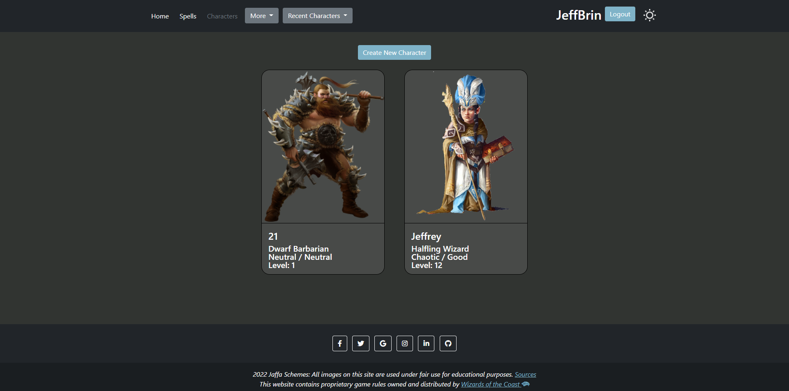
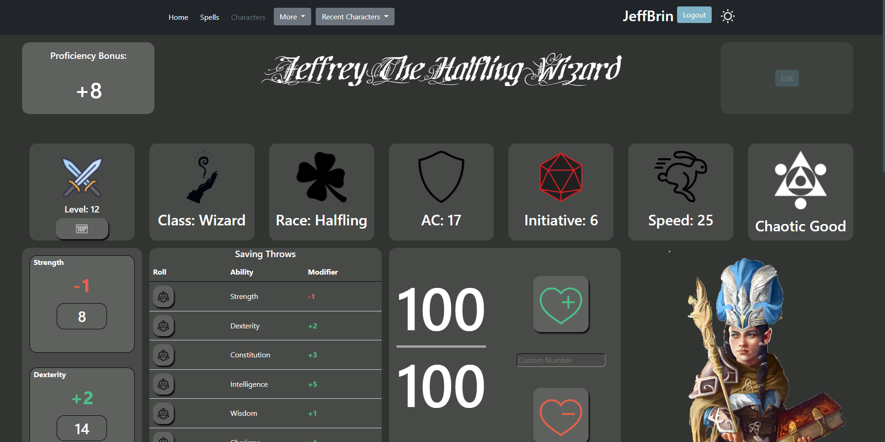
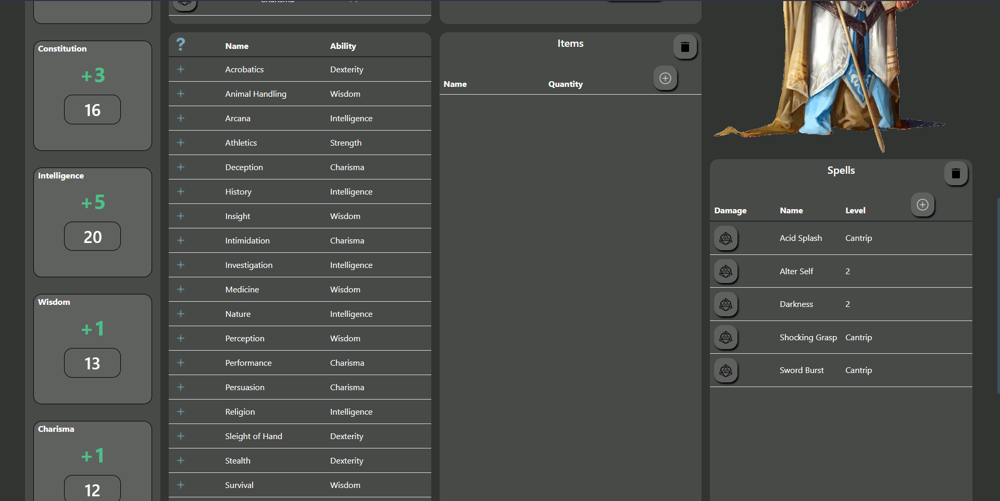
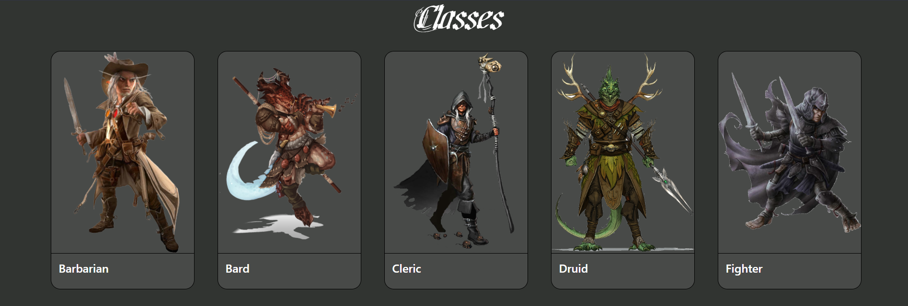
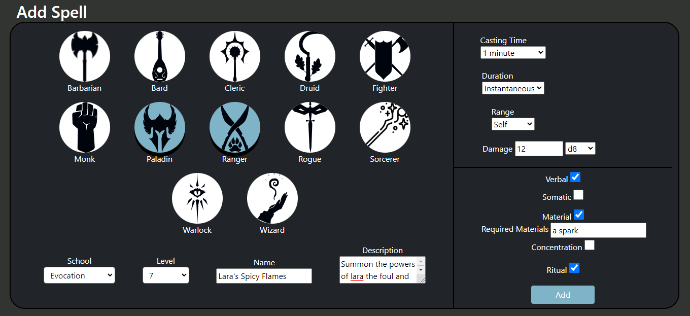

# JaffaSchemes-dnd-website
Final project for John Abbott College Web Programming 2. A dungeons and dragons online character sheet website.

## The Team
* Jeffrey Bringolf
* Samuel Anderson
* Chase Lipari

## Goal
Our goal was to make an intuitive dungeons and dragons character creator and virtual character sheet. We find that typically, dungeons and dragons websites only focus on the character creation aspects of dnd.
The best you can find as far as character sheets go are some spiced up editable pdfs. Our website solves this problem by providing and intuitive character creation AND character sheet experience.

## Add as many characters as you want!

## Edit them in real time while you play.

## Learn the rules and character options.

## Homebrew your very own spells
